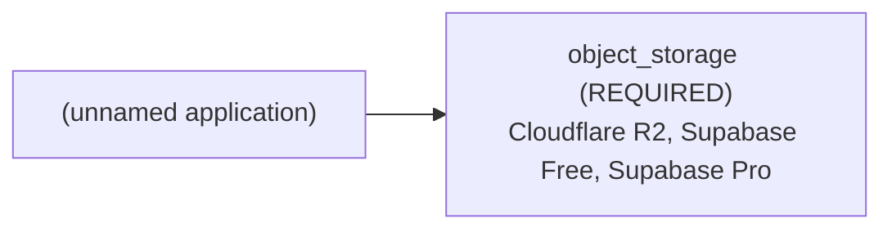

# Architecture Brief: (unnamed application)

## Application summary

For a web app that allows simple image uploads, how should I store the images? Confused about file system vs. cdn

Every search result says something about storing the images in the file system but store the paths in the database, but I'm not sure exactly what "file system" means. Would that mean you have something like: /public (assets) /js /css /img /app (frontend) /server (backend) and you'd upload directly to that /public/img directory? I remember trying something like that in the past with a Node.js app hosted on Heroku, and it wouldn't let me. I had to set up Amazon S3 and upload the images THERE, which leads to my confusion. Is using something like Amazon S3 the usual practice or do people upload directly to the /img directory (assuming this is the "file system"?) and it just happened to be the case that Heroku doesn't allow this but other hosts do?

## Confirmed requirements (stated by the user)

- `capabilities.file_uploads` = true (USER) — "a web app that allows simple image uploads"

## Assumptions and provenance (INFERRED — not verified)

- none

## Abstract architecture

| Component | Status | Spec | Provenance | Rules |
|---|---|---|---|---|
| cache | NOT_REQUIRED | — | RULE | CACHE-DEFAULT-001 |
| object_storage | REQUIRED | access_mode=UNKNOWN, delivery=UNKNOWN, minimum_capacity=UNKNOWN | USER, RULE, UNKNOWN | STORAGE-001 |

## Provider options (from seeded, sourced facts; the tool does not pick one)

- Cloudflare R2: provider FEASIBLE, budget UNVERIFIED (0.0 USD/month fixed; monthly budget is unknown)
- Supabase Free: provider UNVERIFIED, budget UNVERIFIED (0.0 USD/month fixed; monthly budget is unknown)
- Supabase Pro: provider UNVERIFIED, budget UNVERIFIED (25.0 USD/month fixed; monthly budget is unknown)
- Compatibility between providers: DEFERRED (not verified in V1)

## Feasibility

- architecture: FEASIBLE
- provider: FEASIBLE
- budget: UNVERIFIED
- compatibility: DEFERRED
- provider: object_storage: satisfied by verified facts of Cloudflare R2
- budget: no configuration can be verified within budget

Missing evidence:
- Supabase Pro: no fact for object_storage.max_capacity_gb

## Unresolved / UNDETERMINED decisions

- object_storage.access_mode: UNKNOWN
- object_storage.delivery: UNKNOWN
- object_storage.minimum_capacity: UNKNOWN
- budget feasibility: UNVERIFIED
- compatibility: DEFERRED (cross-provider integration is not verified in V1)
- clarification stopped after 1 round(s): blocking_unknowns_already_asked

## Scaling triggers

- none: no documented scaling rule exists in V1

## Items deliberately avoided

- cache: NOT_REQUIRED (default-avoid rule; no requirement justifies it)

## Major decisions

- **cache** → NOT_REQUIRED [RULE; CACHE-DEFAULT-001]: NOT_REQUIRED per CACHE-DEFAULT-001
- **object_storage** → REQUIRED [USER, RULE, UNKNOWN; STORAGE-001]: REQUIRED per STORAGE-001; blocked by access_mode, delivery, minimum_capacity
- **feasibility.architecture** → FEASIBLE [RULE; architecture-rules.md G-7]: no rule conflicts
- **feasibility.provider** → FEASIBLE [PROVIDER_FACT; seeded provider facts]: provider: object_storage: satisfied by verified facts of Cloudflare R2
- **feasibility.budget** → UNVERIFIED [UNKNOWN, PROVIDER_FACT; constraints.monthly_budget, constraints.currency, seeded pricing facts]: budget: no configuration can be verified within budget
- **feasibility.compatibility** → DEFERRED [UNKNOWN; decision-resolution.md: compatibility deferred in V1]: cross-provider compatibility is not verified in V1

## Architecture diagram

## Implementation instructions for your coding agent

You are implementing (unnamed application): For a web app that allows simple image uploads, how should I store the images? Confused about file system vs. cdn

Every search result says something about storing the images in the file system but store the paths in the database, but I'm not sure exactly what "file system" means. Would that mean you have something like: /public (assets) /js /css /img /app (frontend) /server (backend) and you'd upload directly to that /public/img directory? I remember trying something like that in the past with a Node.js app hosted on Heroku, and it wouldn't let me. I had to set up Amazon S3 and upload the images THERE, which leads to my confusion. Is using something like Amazon S3 the usual practice or do people upload directly to the /img directory (assuming this is the "file system"?) and it just happened to be the case that Heroku doesn't allow this but other hosts do?

Infrastructure components determined by this plan (do not add other infrastructure without asking the user):
- object_storage [REQUIRED]: access_mode=UNKNOWN, delivery=UNKNOWN, minimum_capacity=UNKNOWN

Provider options (ask the user to choose; do not choose for them):
- Cloudflare R2 (provider FEASIBLE, budget UNVERIFIED)
- Supabase Free (provider UNVERIFIED, budget UNVERIFIED)
- Supabase Pro (provider UNVERIFIED, budget UNVERIFIED)

Rules:
- Any value marked UNKNOWN or UNDETERMINED is unresolved: ask the user before implementing that part; never fill it with a default.
- Cross-provider compatibility is DEFERRED (unverified); verify integrations yourself before relying on them.
- Do not add: cache (deliberately avoided; no requirement justifies it).

Unresolved items to ask the user about:
- object_storage.access_mode: UNKNOWN
- object_storage.delivery: UNKNOWN
- object_storage.minimum_capacity: UNKNOWN
- budget feasibility: UNVERIFIED
