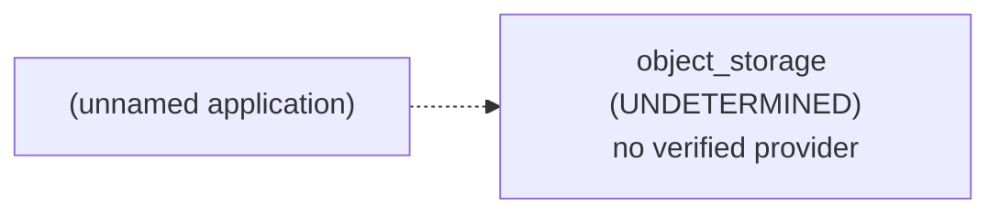

# Architecture Brief: (unnamed application)

## Application summary

Creating a scalable database for android app | cloud hosted

I am working to launch an app which in future will store huge number of users and there profile information. But I Wanted to start small to pre-test my app idea , so what will be the options for hosting database which are cost effective initially and scalable in future , and easy to integrate too. Many thanks for your inputs

## Confirmed requirements (stated by the user)

- none

## Assumptions and provenance (INFERRED — not verified)

- `capabilities.authentication` = true (INFERENCE) — "store huge number of users and there profile information"

## Abstract architecture

| Component | Status | Spec | Provenance | Rules |
|---|---|---|---|---|
| cache | NOT_REQUIRED | — | RULE | CACHE-DEFAULT-001 |
| object_storage | UNDETERMINED | access_mode=UNKNOWN, delivery=UNKNOWN, minimum_capacity=UNKNOWN | UNKNOWN, RULE | STORAGE-001 |

## Provider options (from seeded, sourced facts; the tool does not pick one)

- none: no configuration of seeded providers covers the REQUIRED components
- Compatibility between providers: DEFERRED (not verified in V1)

## Feasibility

- architecture: FEASIBLE
- provider: UNVERIFIED
- budget: UNVERIFIED
- compatibility: DEFERRED
- provider: cannot evaluate while object_storage UNDETERMINED (G-17)
- budget: cannot evaluate while object_storage UNDETERMINED (G-17)

## Unresolved / UNDETERMINED decisions

- capabilities.authentication=true: no V1 architecture rule; infrastructure for it is not determined by this tool
- object_storage: UNDETERMINED (blocked by capabilities.file_uploads)
- provider feasibility: UNVERIFIED
- budget feasibility: UNVERIFIED
- compatibility: DEFERRED (cross-provider integration is not verified in V1)
- clarification stopped after 2 round(s): blocking_unknowns_already_asked

## Scaling triggers

- none: no documented scaling rule exists in V1

## Items deliberately avoided

- cache: NOT_REQUIRED (default-avoid rule; no requirement justifies it)

## Major decisions

- **cache** → NOT_REQUIRED [RULE; CACHE-DEFAULT-001]: NOT_REQUIRED per CACHE-DEFAULT-001
- **object_storage** → UNDETERMINED [UNKNOWN, RULE; STORAGE-001]: UNDETERMINED per STORAGE-001; blocked by capabilities.file_uploads
- **feasibility.architecture** → FEASIBLE [RULE; architecture-rules.md G-7]: no rule conflicts
- **feasibility.provider** → UNVERIFIED [PROVIDER_FACT; seeded provider facts]: provider: cannot evaluate while object_storage UNDETERMINED (G-17)
- **feasibility.budget** → UNVERIFIED [UNKNOWN, PROVIDER_FACT; constraints.monthly_budget, constraints.currency, seeded pricing facts]: budget: cannot evaluate while object_storage UNDETERMINED (G-17)
- **feasibility.compatibility** → DEFERRED [UNKNOWN; decision-resolution.md: compatibility deferred in V1]: cross-provider compatibility is not verified in V1

## Architecture diagram

## Implementation instructions for your coding agent

You are implementing (unnamed application): Creating a scalable database for android app | cloud hosted

I am working to launch an app which in future will store huge number of users and there profile information. But I Wanted to start small to pre-test my app idea , so what will be the options for hosting database which are cost effective initially and scalable in future , and easy to integrate too. Many thanks for your inputs

Infrastructure components determined by this plan (do not add other infrastructure without asking the user):
- object_storage [UNDETERMINED]: access_mode=UNKNOWN, delivery=UNKNOWN, minimum_capacity=UNKNOWN

Rules:
- Any value marked UNKNOWN or UNDETERMINED is unresolved: ask the user before implementing that part; never fill it with a default.
- Cross-provider compatibility is DEFERRED (unverified); verify integrations yourself before relying on them.
- Do not add: cache (deliberately avoided; no requirement justifies it).

Unresolved items to ask the user about:
- capabilities.authentication=true: no V1 architecture rule; infrastructure for it is not determined by this tool
- object_storage: UNDETERMINED (blocked by capabilities.file_uploads)
- provider feasibility: UNVERIFIED
- budget feasibility: UNVERIFIED
