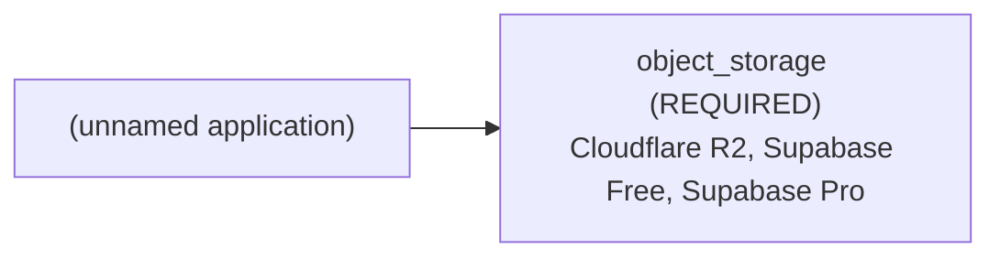

# Architecture Brief: (unnamed application)

## Application summary

Upload images to database

I am new i WPF but i make wpf application which have sql database server. My Database is only 20 mb because it's on "appharbor". In this app every user can upload image for avatar but i can't save this pictures for every user because my db is too small. Can you recommend me where to save these images and how to upload their urls in db so every user can see other users avatar picture.If anyone can give me other ideas how to upload images for every user to database tell please me. Also i don't have money to buy host because i am from Bulgaria and i am student 11-th grade. Thank you a lot.

## Confirmed requirements (stated by the user)

- `capabilities.file_uploads` = true (USER) — "every user can upload image for avatar"

## Assumptions and provenance (INFERRED — not verified)

- `capabilities.authentication` = true (INFERENCE) — "every user can upload image for avatar"
- `operations.public_asset_delivery` = true (INFERENCE) — "so every user can see other users avatar picture"
- `storage.access_mode` = "public" (INFERENCE) — "so every user can see other users avatar picture"

## Abstract architecture

| Component | Status | Spec | Provenance | Rules |
|---|---|---|---|---|
| cache | NOT_REQUIRED | — | RULE | CACHE-DEFAULT-001 |
| object_storage | REQUIRED | access_mode=public, delivery=UNKNOWN, minimum_capacity=UNKNOWN | USER, RULE, INFERENCE, UNKNOWN | STORAGE-001 |

## Provider options (from seeded, sourced facts; the tool does not pick one)

- Cloudflare R2: provider FEASIBLE, budget UNVERIFIED (0.0 USD/month fixed; monthly budget is unknown)
- Supabase Free: provider UNVERIFIED, budget UNVERIFIED (0.0 USD/month fixed; monthly budget is unknown)
- Supabase Pro: provider UNVERIFIED, budget UNVERIFIED (25.0 USD/month fixed; monthly budget is unknown)
- Compatibility between providers: DEFERRED (not verified in V1)

## Feasibility

- architecture: FEASIBLE
- provider: FEASIBLE
- budget: UNVERIFIED
- compatibility: DEFERRED
- provider: object_storage: satisfied by verified facts of Cloudflare R2
- budget: no configuration can be verified within budget

Missing evidence:
- Supabase Pro: no fact for object_storage.max_capacity_gb

## Unresolved / UNDETERMINED decisions

- capabilities.authentication=true: no V1 architecture rule; infrastructure for it is not determined by this tool
- object_storage.delivery: UNKNOWN
- object_storage.minimum_capacity: UNKNOWN
- budget feasibility: UNVERIFIED
- compatibility: DEFERRED (cross-provider integration is not verified in V1)
- clarification stopped after 1 round(s): blocking_unknowns_already_asked

## Scaling triggers

- none: no documented scaling rule exists in V1

## Items deliberately avoided

- cache: NOT_REQUIRED (default-avoid rule; no requirement justifies it)

## Major decisions

- **cache** → NOT_REQUIRED [RULE; CACHE-DEFAULT-001]: NOT_REQUIRED per CACHE-DEFAULT-001
- **object_storage** → REQUIRED [USER, RULE, INFERENCE, UNKNOWN; STORAGE-001]: REQUIRED per STORAGE-001; blocked by delivery, minimum_capacity
- **feasibility.architecture** → FEASIBLE [RULE; architecture-rules.md G-7]: no rule conflicts
- **feasibility.provider** → FEASIBLE [PROVIDER_FACT; seeded provider facts]: provider: object_storage: satisfied by verified facts of Cloudflare R2
- **feasibility.budget** → UNVERIFIED [UNKNOWN, PROVIDER_FACT; constraints.monthly_budget, constraints.currency, seeded pricing facts]: budget: no configuration can be verified within budget
- **feasibility.compatibility** → DEFERRED [UNKNOWN; decision-resolution.md: compatibility deferred in V1]: cross-provider compatibility is not verified in V1

## Architecture diagram

## Implementation instructions for your coding agent

You are implementing (unnamed application): Upload images to database

I am new i WPF but i make wpf application which have sql database server. My Database is only 20 mb because it's on "appharbor". In this app every user can upload image for avatar but i can't save this pictures for every user because my db is too small. Can you recommend me where to save these images and how to upload their urls in db so every user can see other users avatar picture.If anyone can give me other ideas how to upload images for every user to database tell please me. Also i don't have money to buy host because i am from Bulgaria and i am student 11-th grade. Thank you a lot.

Infrastructure components determined by this plan (do not add other infrastructure without asking the user):
- object_storage [REQUIRED]: access_mode=public, delivery=UNKNOWN, minimum_capacity=UNKNOWN

Provider options (ask the user to choose; do not choose for them):
- Cloudflare R2 (provider FEASIBLE, budget UNVERIFIED)
- Supabase Free (provider UNVERIFIED, budget UNVERIFIED)
- Supabase Pro (provider UNVERIFIED, budget UNVERIFIED)

Rules:
- Any value marked UNKNOWN or UNDETERMINED is unresolved: ask the user before implementing that part; never fill it with a default.
- Cross-provider compatibility is DEFERRED (unverified); verify integrations yourself before relying on them.
- Do not add: cache (deliberately avoided; no requirement justifies it).

Unresolved items to ask the user about:
- capabilities.authentication=true: no V1 architecture rule; infrastructure for it is not determined by this tool
- object_storage.delivery: UNKNOWN
- object_storage.minimum_capacity: UNKNOWN
- budget feasibility: UNVERIFIED
