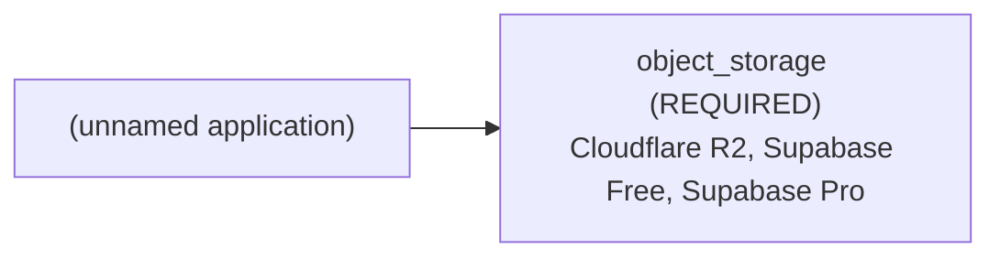

# Architecture Brief: (unnamed application)

## Application summary

Want to build application like Skype or Whatsapp

I want to build an application on android platform with the features of video call and text messages over Internet, similar of VOIP which has video streaming function. Can any one help what are the requirements to build this project and where to start with? I have came up with many online solution which ask me to register to this sites and after that I can build an application using there source code and libraries but I have to pay a lot for using their service. I manage to build the protocol of this project to run on the local network using socket connection. Now I want to make it work for over Internet but their are many obstacles. First is the NAT which block my socket connection to particular ports. So I thing I have to use some this else other then Socket connection but I don't know what should I go for. Another is I tried to work on Openfire server which allows me to register users and maintains the user data on server sideand build client app which can handle chat and file transfer but cannot perform video call function. I want to build an application on android device which will allow user to login and chat/videocall/file transfer with the people who are added in their contact list. Thank you for reading my query I hope you understand my requirements, please do reply if you have any experience or idea for how should this project be build and what are the requirements.

## Confirmed requirements (stated by the user)

- `capabilities.authentication` = true (USER) — "allow user to login"

## Assumptions and provenance (INFERRED — not verified)

- `capabilities.file_uploads` = true (INFERENCE) — "chat/videocall/file transfer"
- `capabilities.realtime` = true (INFERENCE) — "video call and text messages over Internet"

## Abstract architecture

| Component | Status | Spec | Provenance | Rules |
|---|---|---|---|---|
| cache | NOT_REQUIRED | — | RULE | CACHE-DEFAULT-001 |
| object_storage | REQUIRED | access_mode=UNKNOWN, delivery=UNKNOWN, minimum_capacity=UNKNOWN | INFERENCE, RULE, UNKNOWN | STORAGE-001 |

## Provider options (from seeded, sourced facts; the tool does not pick one)

- Cloudflare R2: provider FEASIBLE, budget UNVERIFIED (0.0 USD/month fixed; monthly budget is unknown)
- Supabase Free: provider UNVERIFIED, budget UNVERIFIED (0.0 USD/month fixed; monthly budget is unknown)
- Supabase Pro: provider UNVERIFIED, budget UNVERIFIED (25.0 USD/month fixed; monthly budget is unknown)
- Compatibility between providers: DEFERRED (not verified in V1)

## Feasibility

- architecture: FEASIBLE
- provider: FEASIBLE
- budget: UNVERIFIED
- compatibility: DEFERRED
- provider: object_storage: satisfied by verified facts of Cloudflare R2
- budget: no configuration can be verified within budget

Missing evidence:
- Supabase Pro: no fact for object_storage.max_capacity_gb

## Unresolved / UNDETERMINED decisions

- capabilities.authentication=true: no V1 architecture rule; infrastructure for it is not determined by this tool
- capabilities.realtime=true: no V1 architecture rule; infrastructure for it is not determined by this tool
- object_storage.access_mode: UNKNOWN
- object_storage.delivery: UNKNOWN
- object_storage.minimum_capacity: UNKNOWN
- budget feasibility: UNVERIFIED
- compatibility: DEFERRED (cross-provider integration is not verified in V1)
- clarification stopped after 1 round(s): blocking_unknowns_already_asked

## Scaling triggers

- none: no documented scaling rule exists in V1

## Items deliberately avoided

- cache: NOT_REQUIRED (default-avoid rule; no requirement justifies it)

## Major decisions

- **cache** → NOT_REQUIRED [RULE; CACHE-DEFAULT-001]: NOT_REQUIRED per CACHE-DEFAULT-001
- **object_storage** → REQUIRED [INFERENCE, RULE, UNKNOWN; STORAGE-001]: REQUIRED per STORAGE-001; blocked by access_mode, delivery, minimum_capacity
- **feasibility.architecture** → FEASIBLE [RULE; architecture-rules.md G-7]: no rule conflicts
- **feasibility.provider** → FEASIBLE [PROVIDER_FACT; seeded provider facts]: provider: object_storage: satisfied by verified facts of Cloudflare R2
- **feasibility.budget** → UNVERIFIED [UNKNOWN, PROVIDER_FACT; constraints.monthly_budget, constraints.currency, seeded pricing facts]: budget: no configuration can be verified within budget
- **feasibility.compatibility** → DEFERRED [UNKNOWN; decision-resolution.md: compatibility deferred in V1]: cross-provider compatibility is not verified in V1

## Architecture diagram

## Implementation instructions for your coding agent

You are implementing (unnamed application): Want to build application like Skype or Whatsapp

I want to build an application on android platform with the features of video call and text messages over Internet, similar of VOIP which has video streaming function. Can any one help what are the requirements to build this project and where to start with? I have came up with many online solution which ask me to register to this sites and after that I can build an application using there source code and libraries but I have to pay a lot for using their service. I manage to build the protocol of this project to run on the local network using socket connection. Now I want to make it work for over Internet but their are many obstacles. First is the NAT which block my socket connection to particular ports. So I thing I have to use some this else other then Socket connection but I don't know what should I go for. Another is I tried to work on Openfire server which allows me to register users and maintains the user data on server sideand build client app which can handle chat and file transfer but cannot perform video call function. I want to build an application on android device which will allow user to login and chat/videocall/file transfer with the people who are added in their contact list. Thank you for reading my query I hope you understand my requirements, please do reply if you have any experience or idea for how should this project be build and what are the requirements.

Infrastructure components determined by this plan (do not add other infrastructure without asking the user):
- object_storage [REQUIRED]: access_mode=UNKNOWN, delivery=UNKNOWN, minimum_capacity=UNKNOWN

Provider options (ask the user to choose; do not choose for them):
- Cloudflare R2 (provider FEASIBLE, budget UNVERIFIED)
- Supabase Free (provider UNVERIFIED, budget UNVERIFIED)
- Supabase Pro (provider UNVERIFIED, budget UNVERIFIED)

Rules:
- Any value marked UNKNOWN or UNDETERMINED is unresolved: ask the user before implementing that part; never fill it with a default.
- Cross-provider compatibility is DEFERRED (unverified); verify integrations yourself before relying on them.
- Do not add: cache (deliberately avoided; no requirement justifies it).

Unresolved items to ask the user about:
- capabilities.authentication=true: no V1 architecture rule; infrastructure for it is not determined by this tool
- capabilities.realtime=true: no V1 architecture rule; infrastructure for it is not determined by this tool
- object_storage.access_mode: UNKNOWN
- object_storage.delivery: UNKNOWN
- object_storage.minimum_capacity: UNKNOWN
- budget feasibility: UNVERIFIED
