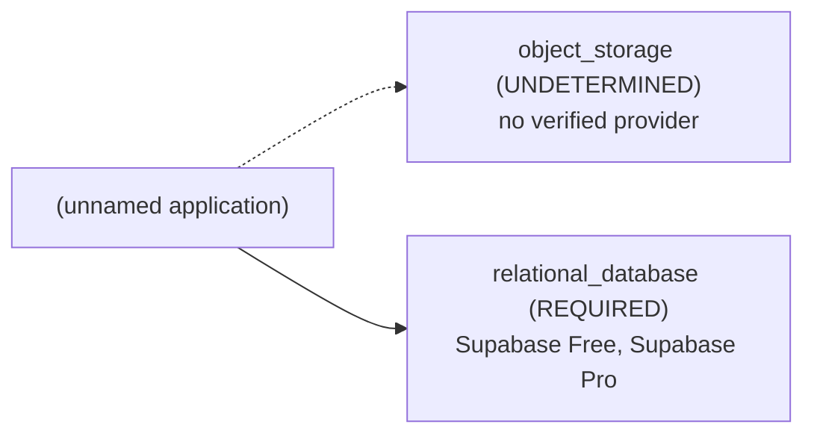

# Architecture Brief: (unnamed application)

## Application summary

I'm trying to work out how to structure a database schema that allows me to have multiple authentication sources for the same end-user. For example, my web app would require users to sign in to utilize many of the functionality of features of the app. However, I do not want to be responsible for storing and authenticating user passwords. So I would still need a database table of users, but no column for a password. But I would still need to somehow associate my user with the identity providers user id. For example, if my user signs up with Google, I would store the users Google ID and associate this with my user. Meaning next time the user makes an attempt to login and is successfully authenticated at Google, I would make an attempt to find any user in my system that has this associated user id. The way I imagine it, it would allow me to associated multiple authentication sources for one app user. Meaning once I've signed up with Google, I can go to my settings and associate another account, for example, a Facebook account.

## Confirmed requirements (stated by the user)

- `capabilities.authentication` = true (USER) — "my web app would require users to sign in to utilize many of the functionality of features of the app"
- `capabilities.data_persistence` = true (USER) — "I would still need a database table of users"

## Assumptions and provenance (INFERRED — not verified)

- none

## Abstract architecture

| Component | Status | Spec | Provenance | Rules |
|---|---|---|---|---|
| cache | NOT_REQUIRED | — | RULE | CACHE-DEFAULT-001 |
| object_storage | UNDETERMINED | access_mode=UNKNOWN, delivery=UNKNOWN, minimum_capacity=UNKNOWN | UNKNOWN, RULE | STORAGE-001 |
| relational_database | REQUIRED | minimum_capacity=UNKNOWN | USER, RULE, UNKNOWN | DATABASE-001 |

## Provider options (from seeded, sourced facts; the tool does not pick one)

- Supabase Free: provider UNVERIFIED, budget UNVERIFIED (0.0 USD/month fixed; monthly budget is unknown)
- Supabase Pro: provider UNVERIFIED, budget UNVERIFIED (25.0 USD/month fixed; monthly budget is unknown)
- Compatibility between providers: DEFERRED (not verified in V1)

## Feasibility

- architecture: FEASIBLE
- provider: UNVERIFIED
- budget: UNVERIFIED
- compatibility: DEFERRED
- provider: relational_database: seeded offerings lack the verified facts needed to confirm the spec {'minimum_capacity': 'UNKNOWN'}
- budget: no configuration can be verified within budget

## Unresolved / UNDETERMINED decisions

- capabilities.authentication=true: no V1 architecture rule; infrastructure for it is not determined by this tool
- object_storage: UNDETERMINED (blocked by capabilities.file_uploads)
- relational_database.minimum_capacity: UNKNOWN
- provider feasibility: UNVERIFIED
- budget feasibility: UNVERIFIED
- compatibility: DEFERRED (cross-provider integration is not verified in V1)
- clarification stopped after 2 round(s): blocking_unknowns_already_asked

## Scaling triggers

- none: no documented scaling rule exists in V1

## Items deliberately avoided

- cache: NOT_REQUIRED (default-avoid rule; no requirement justifies it)

## Major decisions

- **cache** → NOT_REQUIRED [RULE; CACHE-DEFAULT-001]: NOT_REQUIRED per CACHE-DEFAULT-001
- **object_storage** → UNDETERMINED [UNKNOWN, RULE; STORAGE-001]: UNDETERMINED per STORAGE-001; blocked by capabilities.file_uploads
- **relational_database** → REQUIRED [USER, RULE, UNKNOWN; DATABASE-001]: REQUIRED per DATABASE-001; blocked by minimum_capacity
- **feasibility.architecture** → FEASIBLE [RULE; architecture-rules.md G-7]: no rule conflicts
- **feasibility.provider** → UNVERIFIED [PROVIDER_FACT; seeded provider facts]: provider: relational_database: seeded offerings lack the verified facts needed to confirm the spec {'minimum_capacity': 'UNKNOWN'}
- **feasibility.budget** → UNVERIFIED [UNKNOWN, PROVIDER_FACT; constraints.monthly_budget, constraints.currency, seeded pricing facts]: budget: no configuration can be verified within budget
- **feasibility.compatibility** → DEFERRED [UNKNOWN; decision-resolution.md: compatibility deferred in V1]: cross-provider compatibility is not verified in V1

## Architecture diagram

## Implementation instructions for your coding agent

You are implementing (unnamed application): I'm trying to work out how to structure a database schema that allows me to have multiple authentication sources for the same end-user. For example, my web app would require users to sign in to utilize many of the functionality of features of the app. However, I do not want to be responsible for storing and authenticating user passwords. So I would still need a database table of users, but no column for a password. But I would still need to somehow associate my user with the identity providers user id. For example, if my user signs up with Google, I would store the users Google ID and associate this with my user. Meaning next time the user makes an attempt to login and is successfully authenticated at Google, I would make an attempt to find any user in my system that has this associated user id. The way I imagine it, it would allow me to associated multiple authentication sources for one app user. Meaning once I've signed up with Google, I can go to my settings and associate another account, for example, a Facebook account.

Infrastructure components determined by this plan (do not add other infrastructure without asking the user):
- object_storage [UNDETERMINED]: access_mode=UNKNOWN, delivery=UNKNOWN, minimum_capacity=UNKNOWN
- relational_database [REQUIRED]: minimum_capacity=UNKNOWN

Provider options (ask the user to choose; do not choose for them):
- Supabase Free (provider UNVERIFIED, budget UNVERIFIED)
- Supabase Pro (provider UNVERIFIED, budget UNVERIFIED)

Rules:
- Any value marked UNKNOWN or UNDETERMINED is unresolved: ask the user before implementing that part; never fill it with a default.
- Cross-provider compatibility is DEFERRED (unverified); verify integrations yourself before relying on them.
- Do not add: cache (deliberately avoided; no requirement justifies it).

Unresolved items to ask the user about:
- capabilities.authentication=true: no V1 architecture rule; infrastructure for it is not determined by this tool
- object_storage: UNDETERMINED (blocked by capabilities.file_uploads)
- relational_database.minimum_capacity: UNKNOWN
- provider feasibility: UNVERIFIED
- budget feasibility: UNVERIFIED
