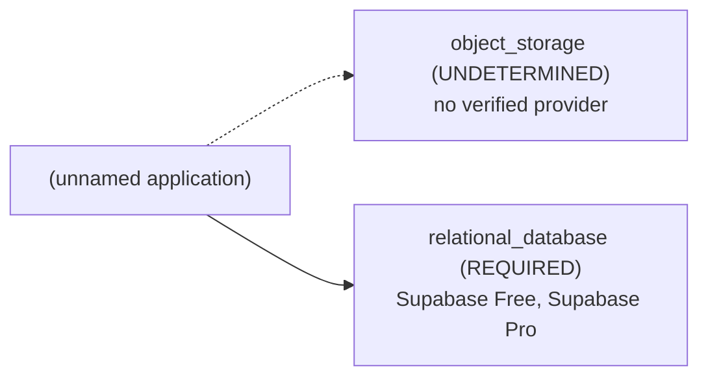

# Architecture Brief: (unnamed application)

## Application summary

I'm just starting to learn about mobile development, backend setup etc. I'm trying to create an Android app in Kotlin that uses one of OpenAI's language models. OpenAI's documentation says that for production apps, all API calls should be routed through a backend server, where the key can be set as an environment variable, to avoid exposing the API key in the app's code. I'm planning to use one of the pre-build backend services such AWS, Back4App or Firebase to store the necessary data for my app. However I'm not sure how to use those, if it is even possible, to route API requests from the app to OpenAI, that is what scripts would I have to run on the server, how to modify the code making the request in the app etc.

## Confirmed requirements (stated by the user)

- `capabilities.ai_inference` = true (USER) — "uses one of OpenAI's language models"
- `capabilities.data_persistence` = true (USER) — "to store the necessary data for my app"

## Assumptions and provenance (INFERRED — not verified)

- none

## Abstract architecture

| Component | Status | Spec | Provenance | Rules |
|---|---|---|---|---|
| cache | NOT_REQUIRED | — | RULE | CACHE-DEFAULT-001 |
| object_storage | UNDETERMINED | access_mode=UNKNOWN, delivery=UNKNOWN, minimum_capacity=UNKNOWN | UNKNOWN, RULE | STORAGE-001 |
| relational_database | REQUIRED | minimum_capacity=UNKNOWN | USER, RULE, UNKNOWN | DATABASE-001 |

## Provider options (from seeded, sourced facts; the tool does not pick one)

- Supabase Free: provider UNVERIFIED, budget UNVERIFIED (0.0 USD/month fixed; monthly budget is unknown)
- Supabase Pro: provider UNVERIFIED, budget UNVERIFIED (25.0 USD/month fixed; monthly budget is unknown)
- Compatibility between providers: DEFERRED (not verified in V1)

## Feasibility

- architecture: FEASIBLE
- provider: UNVERIFIED
- budget: UNVERIFIED
- compatibility: DEFERRED
- provider: relational_database: seeded offerings lack the verified facts needed to confirm the spec {'minimum_capacity': 'UNKNOWN'}
- budget: no configuration can be verified within budget

## Unresolved / UNDETERMINED decisions

- capabilities.ai_inference=true: no V1 architecture rule; infrastructure for it is not determined by this tool
- object_storage: UNDETERMINED (blocked by capabilities.file_uploads)
- relational_database.minimum_capacity: UNKNOWN
- provider feasibility: UNVERIFIED
- budget feasibility: UNVERIFIED
- compatibility: DEFERRED (cross-provider integration is not verified in V1)
- clarification stopped after 2 round(s): blocking_unknowns_already_asked

## Scaling triggers

- none: no documented scaling rule exists in V1

## Items deliberately avoided

- cache: NOT_REQUIRED (default-avoid rule; no requirement justifies it)

## Major decisions

- **cache** → NOT_REQUIRED [RULE; CACHE-DEFAULT-001]: NOT_REQUIRED per CACHE-DEFAULT-001
- **object_storage** → UNDETERMINED [UNKNOWN, RULE; STORAGE-001]: UNDETERMINED per STORAGE-001; blocked by capabilities.file_uploads
- **relational_database** → REQUIRED [USER, RULE, UNKNOWN; DATABASE-001]: REQUIRED per DATABASE-001; blocked by minimum_capacity
- **feasibility.architecture** → FEASIBLE [RULE; architecture-rules.md G-7]: no rule conflicts
- **feasibility.provider** → UNVERIFIED [PROVIDER_FACT; seeded provider facts]: provider: relational_database: seeded offerings lack the verified facts needed to confirm the spec {'minimum_capacity': 'UNKNOWN'}
- **feasibility.budget** → UNVERIFIED [UNKNOWN, PROVIDER_FACT; constraints.monthly_budget, constraints.currency, seeded pricing facts]: budget: no configuration can be verified within budget
- **feasibility.compatibility** → DEFERRED [UNKNOWN; decision-resolution.md: compatibility deferred in V1]: cross-provider compatibility is not verified in V1

## Architecture diagram

## Implementation instructions for your coding agent

You are implementing (unnamed application): I'm just starting to learn about mobile development, backend setup etc. I'm trying to create an Android app in Kotlin that uses one of OpenAI's language models. OpenAI's documentation says that for production apps, all API calls should be routed through a backend server, where the key can be set as an environment variable, to avoid exposing the API key in the app's code. I'm planning to use one of the pre-build backend services such AWS, Back4App or Firebase to store the necessary data for my app. However I'm not sure how to use those, if it is even possible, to route API requests from the app to OpenAI, that is what scripts would I have to run on the server, how to modify the code making the request in the app etc.

Infrastructure components determined by this plan (do not add other infrastructure without asking the user):
- object_storage [UNDETERMINED]: access_mode=UNKNOWN, delivery=UNKNOWN, minimum_capacity=UNKNOWN
- relational_database [REQUIRED]: minimum_capacity=UNKNOWN

Provider options (ask the user to choose; do not choose for them):
- Supabase Free (provider UNVERIFIED, budget UNVERIFIED)
- Supabase Pro (provider UNVERIFIED, budget UNVERIFIED)

Rules:
- Any value marked UNKNOWN or UNDETERMINED is unresolved: ask the user before implementing that part; never fill it with a default.
- Cross-provider compatibility is DEFERRED (unverified); verify integrations yourself before relying on them.
- Do not add: cache (deliberately avoided; no requirement justifies it).

Unresolved items to ask the user about:
- capabilities.ai_inference=true: no V1 architecture rule; infrastructure for it is not determined by this tool
- object_storage: UNDETERMINED (blocked by capabilities.file_uploads)
- relational_database.minimum_capacity: UNKNOWN
- provider feasibility: UNVERIFIED
- budget feasibility: UNVERIFIED
