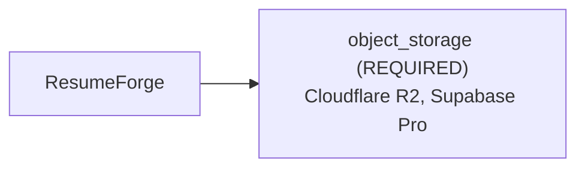

# Architecture Brief: ResumeForge

## Application summary

ResumeForge: job seekers sign in with Google, upload their resume as a PDF and paste a job description, and an LLM rewrites the resume to fit the job. They download the tailored PDF a minute later. Around 200 users at launch, maybe 20 at the same time. I want to keep hosting under $10 a month.

## Confirmed requirements (stated by the user)

- `application.name` = "ResumeForge" (USER) — "ResumeForge"
- `capabilities.authentication` = true (USER) — "job seekers sign in with Google"
- `capabilities.file_uploads` = true (USER) — "upload their resume as a PDF"
- `capabilities.ai_inference` = true (USER) — "an LLM rewrites the resume to fit the job"
- `workload.users` = 200 (USER) — "Around 200 users at launch"
- `workload.peak_concurrency` = 20 (USER) — "maybe 20 at the same time"
- `constraints.monthly_budget` = 10.0 (USER) — "I want to keep hosting under $10 a month"
- `constraints.currency` = "USD" (USER) — "set in review: USD"
- `storage.access_mode` = "private" (USER) — "clarification answer: private"
- `storage.minimum_capacity_gb` = 2.0 (USER) — "clarification answer: 2"

## Assumptions and provenance (INFERRED — not verified)

- `operations.ai_request_duration` = "minutes" (INFERENCE) — "They download the tailored PDF a minute later"

## Abstract architecture

| Component | Status | Spec | Provenance | Rules |
|---|---|---|---|---|
| cache | NOT_REQUIRED | — | RULE | CACHE-DEFAULT-001 |
| object_storage | REQUIRED | access_mode=private, delivery=UNKNOWN, minimum_capacity=2.0 | USER, RULE, UNKNOWN | STORAGE-001 |

## Provider options (from seeded, sourced facts; the tool does not pick one)

- Cloudflare R2: provider FEASIBLE, budget UNVERIFIED (0.0 USD/month fixed; fixed cost fits, but usage-priced charges cannot be estimated (usage unknown))
- Supabase Pro: provider UNVERIFIED, budget INFEASIBLE (25.0 USD/month fixed; fixed monthly cost 25.0 USD exceeds the budget of 10.0)
- Compatibility between providers: DEFERRED (not verified in V1)

## Feasibility

- architecture: FEASIBLE
- provider: FEASIBLE
- budget: UNVERIFIED
- compatibility: DEFERRED
- provider: Supabase Free excluded for object_storage: minimum_capacity=2.0: VIOLATED (limit 1)
- provider: object_storage: satisfied by verified facts of Cloudflare R2
- budget: no configuration can be verified within budget

Missing evidence:
- Supabase Pro: no fact for object_storage.max_capacity_gb

## Unresolved / UNDETERMINED decisions

- capabilities.authentication=true: no V1 architecture rule; infrastructure for it is not determined by this tool
- capabilities.ai_inference=true: no V1 architecture rule; infrastructure for it is not determined by this tool
- object_storage.delivery: UNKNOWN
- budget feasibility: UNVERIFIED
- compatibility: DEFERRED (cross-provider integration is not verified in V1)
- clarification stopped after 0 round(s): no_blocking_unknowns

## Scaling triggers

- none: no documented scaling rule exists in V1

## Items deliberately avoided

- cache: NOT_REQUIRED (default-avoid rule; no requirement justifies it)

## Major decisions

- **cache** → NOT_REQUIRED [RULE; CACHE-DEFAULT-001]: NOT_REQUIRED per CACHE-DEFAULT-001
- **object_storage** → REQUIRED [USER, RULE, UNKNOWN; STORAGE-001]: REQUIRED per STORAGE-001; blocked by delivery
- **feasibility.architecture** → FEASIBLE [RULE; architecture-rules.md G-7]: no rule conflicts
- **feasibility.provider** → FEASIBLE [PROVIDER_FACT; seeded provider facts]: provider: Supabase Free excluded for object_storage: minimum_capacity=2.0: VIOLATED (limit 1) | provider: object_storage: satisfied by verified facts of Cloudflare R2
- **feasibility.budget** → UNVERIFIED [USER, PROVIDER_FACT; constraints.monthly_budget, constraints.currency, seeded pricing facts]: budget: no configuration can be verified within budget
- **feasibility.compatibility** → DEFERRED [UNKNOWN; decision-resolution.md: compatibility deferred in V1]: cross-provider compatibility is not verified in V1

## Architecture diagram

## Implementation instructions for your coding agent

You are implementing ResumeForge: ResumeForge: job seekers sign in with Google, upload their resume as a PDF and paste a job description, and an LLM rewrites the resume to fit the job. They download the tailored PDF a minute later. Around 200 users at launch, maybe 20 at the same time. I want to keep hosting under $10 a month.

Infrastructure components determined by this plan (do not add other infrastructure without asking the user):
- object_storage [REQUIRED]: access_mode=private, delivery=UNKNOWN, minimum_capacity=2.0

Provider options (ask the user to choose; do not choose for them):
- Cloudflare R2 (provider FEASIBLE, budget UNVERIFIED)
- Supabase Pro (provider UNVERIFIED, budget INFEASIBLE)

Rules:
- Any value marked UNKNOWN or UNDETERMINED is unresolved: ask the user before implementing that part; never fill it with a default.
- Cross-provider compatibility is DEFERRED (unverified); verify integrations yourself before relying on them.
- Do not add: cache (deliberately avoided; no requirement justifies it).

Unresolved items to ask the user about:
- capabilities.authentication=true: no V1 architecture rule; infrastructure for it is not determined by this tool
- capabilities.ai_inference=true: no V1 architecture rule; infrastructure for it is not determined by this tool
- object_storage.delivery: UNKNOWN
- budget feasibility: UNVERIFIED
